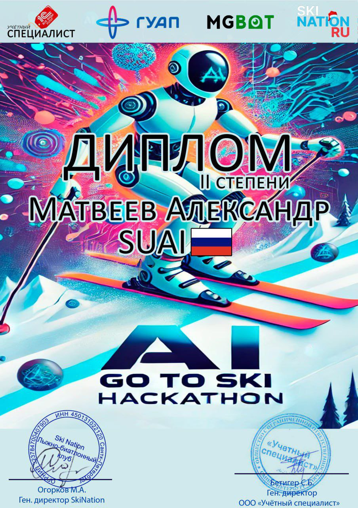

# Aigotoski Bot

Aigotoski Bot — это телеграм-бот с искусственным интеллектом, предназначенный для помощи пользователям в управлении расписанием тренировок, записи на занятия и предоставлении мотивационных советов и стратегий. Бот включает в себя функциональность как для пользователей, так и для администраторов.

## Разработка

Данный проект был разработан в рамках хакатона **AI Go To Ski Hackathon** и получил **Диплом II степени**. 



## Возможности

### Функции для пользователей:
- **Просмотр расписания**: Пользователи могут просматривать доступные тренировки.
- **Запись на тренировки**: Пользователи могут записываться на тренировки прямо через бота.
- **Отмена записей**: Пользователи могут отменять свои записи на тренировки.
- **Получение советов и стратегий**: Пользователи могут получать мотивационные советы и рекомендации по фитнесу от AI-ассистента.
- **Чат с AI-тренером**: Возможность общения с виртуальным тренером на фитнес-темы.

### Функции для администраторов:
- **Добавление тренировок**: Администраторы могут добавлять новые тренировки.
- **Редактирование тренировок**: Возможность обновлять информацию о тренировках (например, название, дату, максимальное количество участников).
- **Удаление тренировок**: Администраторы могут удалять тренировки.
- **Просмотр всех записей**: Администраторы могут видеть все записи пользователей.
- **Панель администратора**: Доступ к специализированной панели для управления.

## Структура проекта
```
Aigotoski-Bot
 ┣ app
 ┃ ┣ database
 ┃ ┃ ┣ models.py       # Модели базы данных (User, Training, Booking)
 ┃ ┃ ┗ requests.py     # Функции взаимодействия с базой данных
 ┃ ┣ admin.py          # Обработчики команд администратора
 ┃ ┣ generators.py     # Логика генерации текста AI
 ┃ ┣ keyboards.py      # Клавиатуры для Telegram (пользователь/админ)
 ┃ ┣ states.py         # Управление состояниями FSM
 ┃ ┗ user.py           # Обработчики команд пользователей
 ┣ .gitignore          # Файлы, игнорируемые Git
 ┣ config.py           # Конфигурационные настройки
 ┣ pyproject.toml      # Управление зависимостями
 ┣ README.md           # Документация проекта
 ┣ requirements.txt    # Python-зависимости
 ┗ run.py              # Точка входа для запуска бота
```

## Установка

### Предварительные требования
- Python 3.10+
- SQLite (используется по умолчанию)
- Токен Telegram бота

### Шаги
1. Клонируйте репозиторий:
   ```bash
   git clone https://github.com/your-repo/aigotoski-bot.git
   cd aigotoski-bot
   ```
2. Установите зависимости:
   ```bash
   pip install -r requirements.txt
   ```
3. Настройте окружение:
   - Обновите значения `TOKEN`, `DB_URL` и `AI_TOKEN` в файле `config.py`.
4. Запустите бота:
   ```bash
   python run.py
   ```

## Использование

### Команды для пользователей:
- `/start` - Регистрация пользователя и отображение приветствия.
- `/help` - Список доступных команд.
- `💪 Записаться на тренировку` - Просмотр доступных тренировок и запись на них.
- `😥 Отменить тренировку` - Просмотр и отмена записей на тренировки.
- `⚡ Советы и стратегии` - Получение мотивационных советов и стратегий от AI-тренера.
- `🗣 Пообщаться с тренером` - Общение с виртуальным тренером.

### Команды для администраторов:
- `/admin` - Доступ к панели администратора.
- `/add_training` - Добавление новой тренировки.
- `/edit_training` - Редактирование информации о тренировке.
- `/delete_training` - Удаление тренировки.
- `/view_all_bookings` - Просмотр всех записей пользователей.
- `/help_admin` - Список команд для администраторов.

## Используемые технологии
- **Aiogram**: Фреймворк для Telegram-ботов.
- **SQLAlchemy**: ORM для работы с базой данных.
- **MistralAI**: Генерация текста с использованием искусственного интеллекта.
- **SQLite**: База данных по умолчанию.
